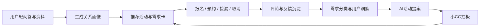

# 🌿 关于恰好关系俱乐部

一句话总结：一个帮主理人把“用户交友需求”反向生成线下活动、并按需招募到对的人的 AI Agent。

> 我是小CC。这个小程序不是想让大家更快滑到更多人，而是想帮那些“想认真认识人、但不想被尴尬推着走”的人，先慢一点、舒服一点地被看见。

## 🔗 在线体验

🌐 **最新外部链接（注册体验版，从欢迎页开始）：**

https://ping-bu-qing-yun.github.io/just-grow-club-community/?reset=registration&v=20260810-final

📦 **GitHub 仓库：**

https://github.com/ping-bu-qing-yun/just-grow-club-community

## 运行方式

这是一个可直接访问、可直接运行的静态 Agent Demo，不依赖 MCP、数据库或后端服务。

- 在线运行：打开上方外部 Demo 链接。
- 本地运行：解压源码 ZIP 后，直接打开 `index.html`，或在目录中启动任意静态文件服务后访问 `index.html`。
- 数据说明：当前演示数据、用户画像、活动提案、运营工作台内容都内置在前端源码中；用户操作状态保存在浏览器本地，不需要额外数据库。

## 我从谁开始创作

这个作品从“小CC”开始。

小CC在上海做线下关系活动。她遇到的不是“没有人想认识人”，而是很多人明明想认识新朋友、想进入亲密关系，却害怕一上来就交换微信、害怕活动像相亲、害怕人太多、也害怕自己不知道怎么表达需求。

小CC真正需要的，不只是一个活动发布工具，而是一个能帮她持续理解用户、整理交友需求、反向生成线下活动提案、再把活动按需招募给合适人群的 Agent。

## 真实场景中的问题

在真实运营里，小CC会反复遇到这些问题：

| 场景 | 具体问题 | 现有产品的不足 |
| --- | --- | --- |
| 👤用户想认识人 | 用户不知道怎么描述自己想要的关系，也不愿意一上来就暴露太多 | 传统交友软件偏“人货架”，重照片和快速筛选，轻需求表达 |
| 🎟️用户想参加活动 | 用户担心活动尴尬、流程不清楚、人数不合适、像相亲 | 活动平台更关注报名转化，不够解释“这场见面为什么适合你” |
| 🛠️小CC做活动 | 她需要从大量聊天、评论、反馈里判断大家到底想要什么 | 普通表单只能收集答案，不能转化为可执行活动提案 |
| 🔁活动运营 | 预活动、成熟活动、报名、预约、捡漏、取消、反馈都需要被管理 | 单纯的发布工具没有形成“需求-提案-活动-反馈”的闭环 |

## 这个 Agent 如何回应需求

恰好关系俱乐部把用户端和小CC运营端放在同一个闭环里：先理解用户真实交友需求，再反向生成活动，并把活动推给更可能合适的人。

**用户侧路径**

1. 从欢迎页进入，先读小CC的**介绍信**——这里不是催促你脱单，而是先确认你舒服的见面方式。
2. 完成轻问答 + 基础资料 → 系统生成关系画像，沉淀「怕尴尬 / 少人数 / 慢热 / 想认真认识」等标签。
3. 首页**按画像推荐**合适的活动与需求卡，而不是让用户盲目浏览。
4. 可报名成熟活动、预约预活动、捡漏满员活动、取消报名并说明原因。
5. 也可发布需求或生活动态，让小CC看到真实的关系表达。

**小CC 运营侧路径**

- 工作台看到：需求分类 · AI 活动提案 · 每日待办 · 经营明细 · 活动管理 · 消息提醒。

## 当前 Demo 已实现的功能

### 用户端

| 模块 | 当前可演示能力 | 满足的用户需求 |
| --- | --- | --- |
| 欢迎页与介绍信页 | 从“开始认识彼此”进入小CC写给用户的介绍说明 | 降低陌生感，让用户知道产品不是冷冰冰的相亲工具 |
| 注册与轻问答 | 初级/中级选择题、高级表达题、基础资料填写、生成关系画像 | 帮用户用更低压力的方式说清楚自己是谁、想遇见什么 |
| 专属推荐页 | 根据画像展示专属活动、需求卡、画像完成度、小猫互动元素 | 让用户感觉“推荐是懂我的”，不是随机列表 |
| 活动发现 | 活动筛选、距离筛选、成熟活动/预活动区分 | 帮用户按压力、距离、主题找到合适见面 |
| 活动详情 | 报名、预约、满员捡漏、取消报名、考虑/不喜欢反馈、评论展示 | 支持从犹豫到行动，也允许用户退出和表达顾虑 |
| 需求与生活 | 发布需求、发布生活、选择标签、上传封面 | 让用户不只被活动选择，也能主动表达关系需求 |
| 我的页面 | 我的记录、收藏、画像、资料编辑、消息、运营入口 | 让用户看到自己的参与痕迹和画像变化 |

### 小CC运营端

| 模块 | 当前可演示能力 | 满足的小CC需求 |
| --- | --- | --- |
| 管理动作入口 | 从“我的”进入小CC管理工作台 | 普通用户路径和运营路径分开，小CC能进入后台 |
| AI活动提案 | 展示基于共鸣需求生成的活动提案，并可查看提案详情 | 把“大家都在说的需求”转成可判断的活动方案 |
| 提案详情 | 展示活动为什么成立、基本盘、流程、现场提问、互动机制、风险提醒 | 帮小CC快速判断是否同意、修改或拒绝提案 |
| 小CC每日分身 | 汇总今日新增需求、待拍板提案、异常、待反馈和行动建议 | 让小CC不用从零翻数据，先看到今天最该处理什么 |
| 经营明细 | 展示月收入、客单、单场收入、近6个月趋势 | 支持小CC判断活动是否能持续经营 |
| 活动管理 | 区分全部、报名中、预活动、待反馈、已结束 | 让预活动到成熟活动的运营过程更清楚 |
| 入驻用户与需求洞察 | 查看用户列表、需求分类、共鸣人数与需求出处 | 帮小CC理解用户画像，而不是只看到空泛数据 |
| 消息与反馈 | 展示报名、缴费、互动、系统通知等提醒 | 支持运营动作闭环 |

## 为什么它是 Agent，而不只是页面 Demo

这个作品的核心不是“做一个漂亮页面”，而是把小CC每天做的判断流程产品化：从用户交友需求出发，反向生成线下活动，再按需招募对的人。

它像一个小CC的运营分身：一边陪用户慢慢表达，一边帮小CC把分散的关系需求整理成可以落地的活动。

## 一次真实使用会发生什么

一个新用户进入后，不会立刻被要求上传照片、刷人或报名。TA会先看到小CC的介绍信，知道这里的基调是“先认识自己，再认识别人”。

完成问答后，用户得到自己的关系画像，比如“低压力线下重启型”“慢热深思者”。系统会推荐少人数、流程明确、不强迫交换微信的活动。用户如果觉得还不确定，可以点“考虑”并留下原因；如果不喜欢，也可以反馈不推荐。

这些反馈会进入小CC的运营视角，成为下一次活动提案和推荐优化的依据。

## 对相似用户的价值

这个作品首先为小CC而做，但它并不只属于小CC。它也适合这些人和团队：

- 做线下交友、关系工作坊、青年社群活动的运营者
- 想组织高质量小局，但不知道用户真实顾虑的人
- 不喜欢高压相亲、但又希望认真认识人的城市青年
- 希望用 AI 把用户需求转成活动方案的小型社区团队

## 当前阶段

这是一个准商用 Demo，重点展示完整体验链路：

`具体用户 -> 真实关系需求 -> 可访问 Agent -> 真实操作路径 -> 小CC运营闭环`

下一步可以继续补强真实数据接入、账号体系、支付/通知、活动发布后台和真实用户反馈分析。
