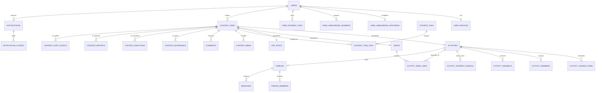

# 恰好俱乐部 MySQL 规范数据模型

状态：已落地为 `001_canonical_domain_schema.sql` 与 `002_dynamic_business_config.sql` 的两段式活动迁移链；远端只完成结构与业务值预检，尚未执行写入迁移。

## 设计结论

本项目不再把“活动、需求、生活”拆成互不相干的 ID 空间。content_items 是三类公开内容的唯一父记录，子表分别承载活动、需求和生活字段；评论、标签、收藏、共鸣、媒体、举报和审计通过 (content_id, content_type) 复合外键指向该父记录。这样既保留当前接口所需的内容类型，也杜绝了旧 comments 只能靠代码判断目标是否存在的问题。

活动保持产品既定的 pre -> formal -> archived 生命周期：

- pre：用户可见，写入 activity_members.status='interested'，不创建活动群聊。
- formal：开放报名，写入 status='joined'，并创建或加入活动群聊。
- archived：从活动列表隐藏；历史记录与反馈仍可保留。

需求与生活的 content_items.status 默认均为 approved，表示发布即上线；该字段只用于后续的下架、归档和风控处置，不构成发布前审核漏斗。



## 需求到表的覆盖

| 项目实际能力 | 规范表 | 关键约束/字段 |
| --- | --- | --- |
| 登录、角色、会话 | users、sessions | 手机号唯一；member/host/operator；仅哈希会话令牌落库 |
| 个人资料与隐私 | user_profiles | 生日、性别、学历、职业、身高、城市/区、关系状态、资料可见性 |
| 三问、QA、用户画像 | user_onboarding_progress、user_onboarding_answers、user_interest_tags | 用稳定 question_key 保存答案；意图、场景、阻力、偏好可分别查询 |
| 活动预告、正式报名、地点与费用 | activities、activity_members | 生命周期、时间区间、地点、人数、费用、参与状态均受约束 |
| 活动流程、安全边界、推荐文案 | activity_agenda_items、activities | sequence_no 唯一；audience/pitch/boundary/match_label 不再仅存在于前端种子 |
| 需求与活动回应关系 | needs、activity_need_links | 一个活动可回应多个需求，避免把单个 responseActivityId 固化在需求行中 |
| 生活动态与多图 | life_posts、content_media | life_posts.image 保留为兼容封面；多图按 sort_order 存放 |
| 内容标签 | content_tags、content_item_tags | 复合外键确保标签类型与内容类型一致 |
| 评论 | comments | 评论目标直接外键到内容父表，支持软删除和游标排序索引 |
| 收藏、需求收藏、共鸣 | content_bookmarks、content_reactions | 收藏不再只限活动；用户对同一内容的共鸣唯一 |
| 考虑/不考虑、反馈 | activity_interest_signals、activity_feedback | “不考虑”原因与累计次数可持久化；每人每场活动一份反馈 |
| 活动群聊和系统会话 | threads、thread_members、messages | 每场活动至多一个群聊；成员、未读数、消息类型可追踪 |
| 通知与 SSE 事件 | notifications、notification_outbox | 可引用内容或会话，避免通知目标只能存无约束字符串 |
| 举报、下架和审计 | content_reports、content_audit_events | 举报和状态/生命周期改变保留操作者、原因、前后快照 |

## 迁移边界

`001_canonical_domain_schema.sql` 固化目标 MySQL 当前 31 张领域基表，`002_dynamic_business_config.sql` 只新增活动分类、onboarding、画像选项、反馈选项、推荐规则、版本与配置审计能力，并补充少量兼容字段和稳定业务键回填。实际执行顺序只以 `REQUIRED_MIGRATIONS` 为准；旧 `001_initial.sql` 至 `009_v2_domain_model.sql` 不再属于活动迁移链。迁移不会删除业务表或业务数据；破坏性清理必须另建迁移，并且只能在隔离 MySQL 8 完成计数、角色矩阵、活动深链、通知与评论抽样后单独批准执行。

迁移器在应用后会校验表、关键字段、索引和外键。执行前可只读预览：

```bash
npm run db:migrate
```

只有在确认目标库、备份与迁移预览无误后才执行：

```bash
npm run db:migrate -- --apply
```

## 当前代码兼容与后续接线

- 既有的 users、sessions、content_items、activities、needs、life_posts、评论、群聊和通知列被保留，因此现有 Fastify 仓储不会因为表名或基础字段消失而失效。
- 活动收藏已改为写入 content_bookmarks，从而为需求/生活收藏留出同一条事实来源。
- user_profiles、问卷、收藏、共鸣、活动反馈、兴趣标签、URL 媒体和消息已经接入 `/api/v2` 与 React Query；浏览器只保留可丢失缓存、未提交草稿和显式预览数据。主理人活动提案保留在规范模型中，本期只开放 operator 查询、编辑、状态处理和归档，不开放 host 创建入口；对象存储上传与举报处置仍不在本期范围。
- `server/schema.sql` 不作为运行时迁移来源；权威可执行 DDL 是 `server/migrations/mysql` 中由 `REQUIRED_MIGRATIONS` 排序声明的迁移链。
